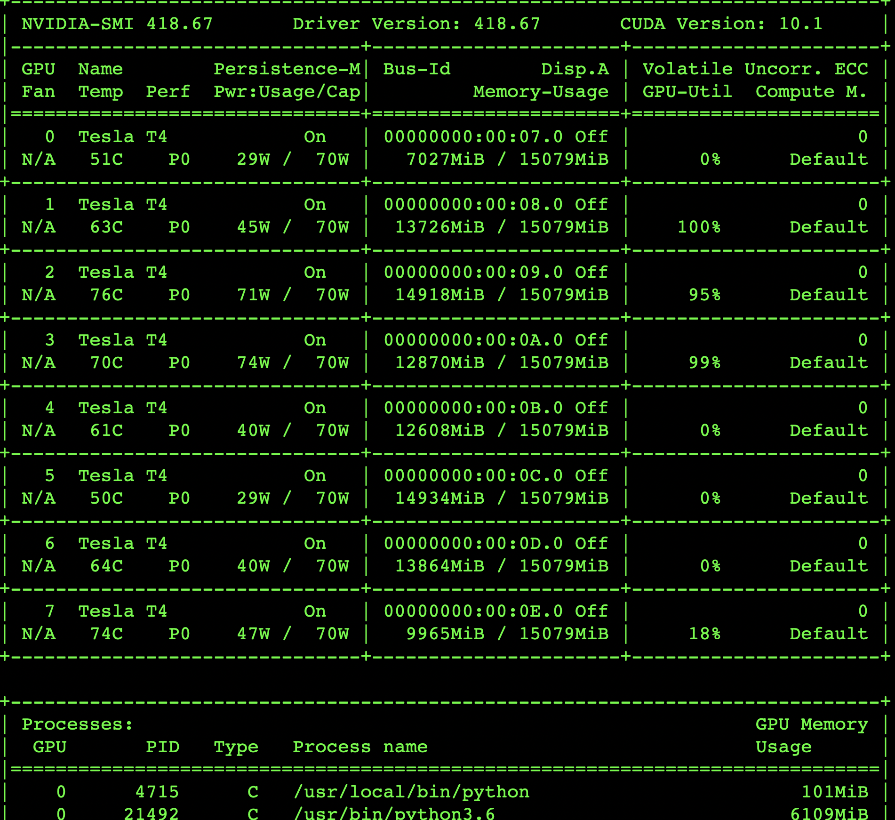

# Multi_dockers_GPU_Visualized_Management
Make some work for managing GPU server in order to save time.
### linux常用查看磁盘空间大小的命令
- ls -lh查看当前目录下文件大小

- df -lh 使用这个命令会更清楚磁盘使用情况

- df-a 查看全部文件大小

- du -h --max-depth=1 查看各文件夹大小

> 首页显示服务器的磁盘使用情况，方便观测相关的数据

### 查看linux服务器gpu使用情况

> 指令：nvidia-smi

#### 参数解释：
表格中会显示显卡的一些信息，第一行是版本信息，第二行是标题栏，第三行就是具体的显卡信息了，如果有多个显卡，会有多行，每一行的信息值对应标题栏对应位置的信息。 
* GPU：编号，显示多卡的编号
* Fan：风扇转速，在0到100%之间变动，
* Name：显卡名
* Temp：显卡温度 
* Perf：性能状态，从P0到P12，P0性能最大，P12最小 
* Persistence-M：持续模式的状态开关，该模式耗能大，但是启动新GPU应用时比较快，这里是off 
* Pwr：能耗 
* Bus-Id：GPU总线
* Disp.A：表示GPU的显示是否初始化 
* Memory-Usage：显存使用率
* GPU-Util：GPU利用率
* Compute M.：计算模式

需要注意的一点是显存占用率和GPU占用率是两个不一样的东西，类似于内存和CPU，两个指标的占用率不一定是互相对应的。
> 首页中直接显示GPU使用情况，方便查看

### docker stats监控容器资源消耗

- docker stats 命令用来显示容器使用的系统资源。
- 默认情况下，stats 命令会每隔 1 秒钟刷新一次输出的内容直到你按下 ctrl + c。下面是输出的主要内容：

    - [CONTAINER]：以短格式显示容器的 ID。
    - [CPU %]：CPU 的使用情况。
    - [MEM USAGE / LIMIT]：当前使用的内存和最大可以使用的内存。
    - [MEM %]：以百分比的形式显示内存使用情况。
    - [NET I/O]：网络 I/O 数据。
    - [BLOCK I/O]：磁盘 I/O 数据。 
    - [PIDS]：PID 号。

只返回当前的状态:如果不想持续的监控容器使用资源的情况，可以通过 --no-stream 选项只输出当前的状态：
> docker stats --no-stream
增加接口显示

